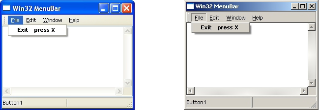



## Menu Bar \- only API

### Description

Original project was written in c++ and today I translate it to vb. Its menu with coolbar and toolbar integrated to give a professional look. No OCX, CTL, no DLL...Picture is worth more than thousand words. Please leave comments. Enjoy.
 
### More Info
 

             |
---                |---
**Submitted On**   |2003-12-18 17:28:00
**By**             |[Aki](https://github.com/Planet-Source-Code/PSCIndex/blob/master/ByAuthor/aki.md)
**Level**          |Intermediate
**User Rating**    |4.9 (49 globes from 10 users)
**Compatibility**  |VB 5\.0, VB 6\.0
**Category**       |[Custom Controls/ Forms/  Menus](https://github.com/Planet-Source-Code/PSCIndex/blob/master/ByCategory/custom-controls-forms-menus__1-4.md)
**World**          |[Visual Basic](https://github.com/Planet-Source-Code/PSCIndex/blob/master/ByWorld/visual-basic.md)
**Archive File**   |[XP\_menu\_\_\_16849312182003\.zip](https://github.com/Planet-Source-Code/aki-menu-bar-only-api__1-50509/archive/master.zip)

